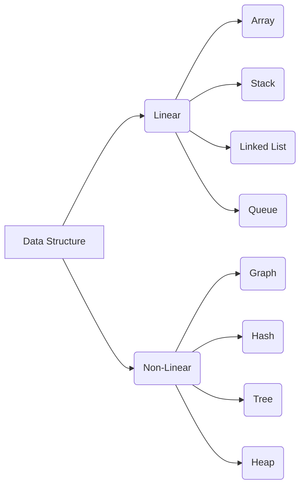
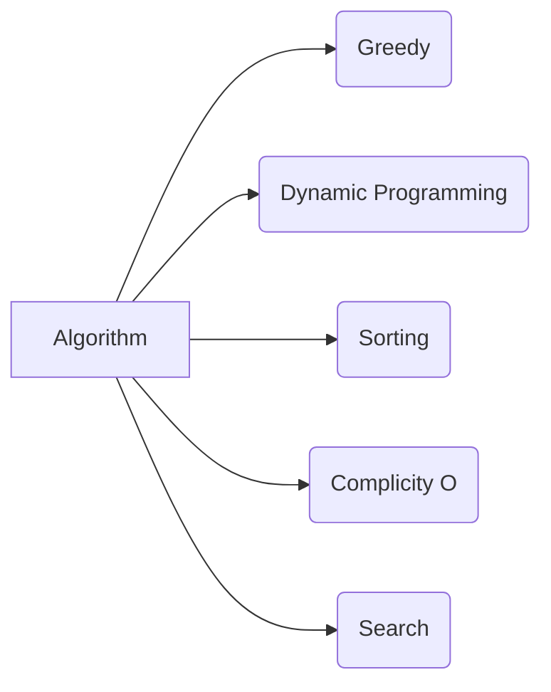

# Data-Structure-with-C++
## Data Structure

## Books
- [Open Data Structures](http://opendatastructures.org/ods-cpp.pdf)
- [Online Website: cplusplus](https://cplusplus.com/doc/tutorial/)
- [Fundamentals of C++ Programming](https://web.archive.org/web/20191005170118/https://python.cs.southern.edu/cppbook/progcpp.pdf)
